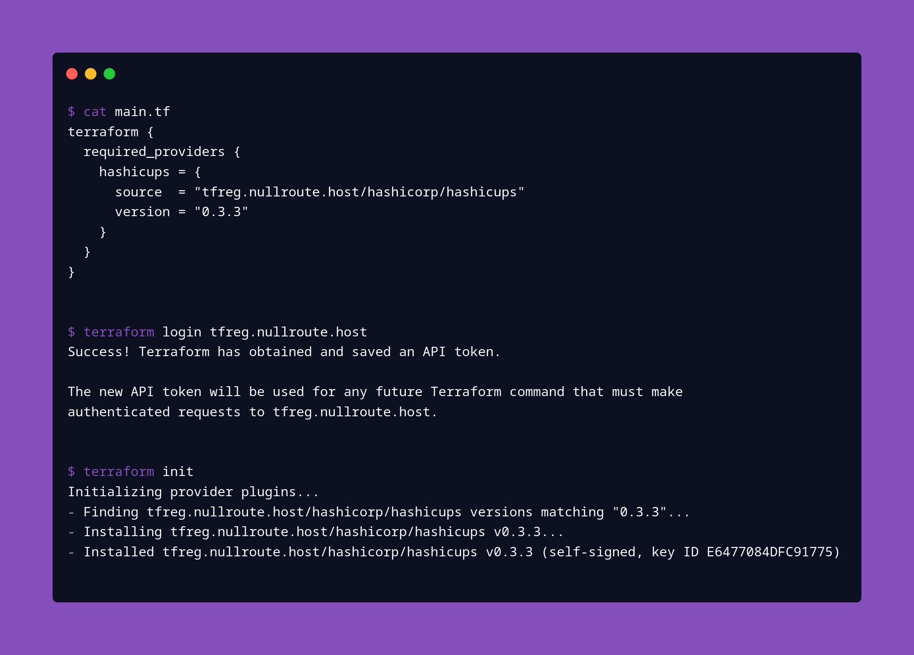

# tfreg: Private Terraform Registry

`tfreg` is a terraform registry server that serves assets stored in github releases.



## Features
- An opinionated implementation of the terraform provider registry. See [required repo structure](#required-repo-structure) for more details.
- A Terraform Login server. This is required for use with private providers, as it uses the github oauth2 flow to use your permissions for downloading assets.

## Installation
Check the github [releases](https://github.com/mattclement/tfreg/releases) or clone the repo and run `cargo build --release`.

## Setup
1. [Generate a new oauth app](https://github.com/settings/applications/new) on GitHub.
    - The `Authorization callback URL` must be a `localhost` URL (e.g. `http://localhost:10000/callback`) since the terraform CLI runs an http server on localhost to receive the code from the redirect url. When the url is on localhost, the port may be changed by `tfreg` to facilitate this specific workflow. See the [github oauth2 docs](https://docs.github.com/en/developers/apps/building-oauth-apps/authorizing-oauth-apps#localhost-redirect-urls) for more information.
2. Generate a new client secret from your new oauth application.
4. Run the app: see the [configuration](#configuration) table below for how to set the necessary properties to run the app.
    - There is no support for serving HTTPS traffic, so you must run some sort of TLS-capable proxy in front, since the terraform CLI will only talk over HTTPS.
5. Test it: `curl localhost:8080/.well-known/terraform.json` (or whatever host/port you're running on) should return a static json payload for the Terraform CLI to interpret.

## Configuration

Configuration values are listed below. **Required fields are shown in bold**. CLI args and environment variables will override values set in an optionally provided TOML configuration file.

| Property                  | Example value    | as CLI flag        | as environment variable | as TOML property |
| ------------------------- | ---------------- | ------------------ | ----------------------- | ---------------- |
| config file               | `config.toml`    | `--config`         | `TFREG_CONFIG`          | N/A              |
| listen addr               | `127.0.0.1:8080` | `--addr`           | `TFREG_ADDR`            | `addr`           |
| rust log filter           | `tfreg=debug`    | `--log-level`      | `TFREG_LOG_LEVEL`       | `log_level`      |
| stdout log format         | `pretty`         | `--log-format`     | `TFREG_LOG_FORMAT`      | `log_format`     |
| OTLP trace collector URL  | `localhost:4317` | `--otlp-endpoint`  | `TFREG_OTLP_ENDPOINT`   | `otlp_endpoint`  |
| cache directory           | `./cache`        | `--cache-dir`      | `TFREG_CACHE_DIR`       | `cache_dir`      |
| **oauth2 client id**      | `abcdef1234`     | `--client-id`      | `TFREG_CLIENT_ID`       | `client_id`      |
| **oauth2 client secret**  | `abcdef1234`     | `--client-secret`  | `TFREG_CLIENT_SECRET`   | `client_secret`  |
| **secret key (32 bytes)** | `abcdef1234`     | `--secret-key`     | `TFREG_SECRET_KEY`      | `secret_key`     |

Note: the rust log filter variable follows the [env logger syntax](https://docs.rs/env_logger/0.9.0/env_logger/#enabling-logging).

## Required repo structure

A single version of a terraform provider corresponds to a github release.

The [`v0.3.3` tagged release of `terraform-provider-hashicups`](https://github.com/hashicorp/terraform-provider-hashicups/releases/tag/v0.3.3) is possible to serve with `tfreg` as it follows the [repo structure rules](#repo-structure-rules):
```
terraform-provider-hashicups_0.3.3_darwin_amd64.zip
terraform-provider-hashicups_0.3.3_darwin_arm64.zip
terraform-provider-hashicups_0.3.3_freebsd_386.zip
terraform-provider-hashicups_0.3.3_freebsd_amd64.zip
terraform-provider-hashicups_0.3.3_freebsd_arm.zip
terraform-provider-hashicups_0.3.3_freebsd_arm64.zip
terraform-provider-hashicups_0.3.3_linux_386.zip
terraform-provider-hashicups_0.3.3_linux_amd64.zip
terraform-provider-hashicups_0.3.3_linux_arm.zip
terraform-provider-hashicups_0.3.3_linux_arm64.zip
terraform-provider-hashicups_0.3.3_SHA256SUMS
terraform-provider-hashicups_0.3.3_SHA256SUMS.sig
terraform-provider-hashicups_0.3.3_windows_386.zip
terraform-provider-hashicups_0.3.3_windows_amd64.zip
terraform-provider-hashicups_0.3.3_windows_arm.zip
terraform-provider-hashicups_0.3.3_windows_arm64.zip
```

### Repo structure rules
- Releases must be tagged as either `v1.2.3` or `1.2.3`.
- There may be a file named `SHA256SUMS` or `<binary_name>-<version>_SHA256SUMS`. **If a binary zip is not listed in this file, it will not be available for download.**
- All binary files must be named as above: `<binary_name>_<version>_<os>_<arch>.zip`. `version` must not contain a `v` prefix.
- Zip files must contain only the binary which must be named the same as the archive, without the `.zip` suffix.

The GPG Key used to sign the sha256sums file is (currently) generated by `tfreg` on startup. It is not required to add a `SHA256SUMS.sig` file, as `tfreg` signs the `SHA256SUMS` file at request-time.
